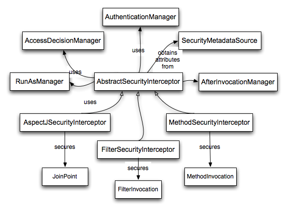

== 技术概况

=== 运行时环境

Spring Security 3.0需要JRE 5.0或更高版本。Spring Security的目标是使用自包含的方式运作，不向JRE中加入任何特殊的配置文件。尤其是不需要去配置特殊的JAAS策略文件，或把Spring Security放到通用的本地classpath中。

类似的，如果你在使用EJB容器或Servlet容器，也不需要到处放置特殊的配置文件，也不需要在服务器的classloader中包含Spring Security。所有需要的文件将只在你的应用中包含。

这样的设计可以根据需要的配置时间灵活地调整你的配置，你可以简单地从一个系统中拷贝目标artifact（可以是一个JAR、WAR或EAR）到其他系统，artifact依旧能够立即运作。

=== Core Components

在Spring Security 3.0中，`spring-security-core` jar的内容被单独剥离。它不再包含任何与web-application安全、LDAP或命名空间配置相关的代码。我们会向你展示一些core模块中的Java类型。它们代表了框架的构建单元，因此如果你需要在namespace配置上更进一步，或者你不想要与它们直接交互，那么理解此模块就显得非常重要。

==== SecurityContextHolder, SecurityContext 以及 Authentication 对象

最基本的对象是`SecurityContextHolder`。这时我们存储当前应用security上下文细节的地方，它包含了当前使用应用的主要细节。`SecurityContextHolder`默认使用一个`ThreadLocal`来包装这些细节，它说明security上下文在总是对同一个执行线程中的方法是可用的，而不管security上下文是否明作为一个参数传递给这些方法。如果你在当前请求被处理之后清除了这个线程，那么使用`ThreadLocal`是非常安全的。当然，你不需要担心这些，因为Spring Security已经自动帮你处理了这些事。

一些应用并不完全使用`ThreadLocal`，因为它们通过特别的方式来使用线程。

例如，一个Swing客户端可能需要JVM中所有的线程都共用同一个security上下文。`SecurityContextHolder`可以配置一种启动策略来指定你所需要的上下文存储方式。你可以使用 `SecurityContextHolder.MODE_GLOBAL`模式来启用单独的应用上下文。

另一些应用程序也许需要由安全的线程衍生出的多个线程，并采用同样的安全标识。这可以使用`SecurityContextHolder.MODE_INHERITABLETHREADLOCAL`模式。

你可以用两种方式改变默认的`SecurityContextHolder.MODE_THREADLOCAL`到此模式。第一种办法是设置系统参数，第二种办法是调用`SecurityContextHolder`的静态方法。

大多数应用不需要改变默认模式，但如果你需要这么做，那就看看`SecurityContextHolder`的JavaDocs吧！

===== 获取关于当前用户的信息

在`SecurityContextHolder`内部，我们包装了与应用交互的主要的一般的细节。Spring Security使用一个`Authentication`对象来代表这些信息。你通常不需要自己创建一个`Authentication`对象，但它对于查询用户查询`Authentication`对象非常有用。你可以在你的应用的任何地方使用下面这些代码，以获取当前认证用户的姓名：

[source,java]
----
Object principal = SecurityContextHolder.getContext().getAuthentication().getPrincipal();

if (principal instanceof UserDetails) {
String username = ((UserDetails)principal).getUsername();
} else {
String username = principal.toString();
}

----

调用`getContext()`方法返回的是一个实现了`SecurityContext`接口的实例。这个对象被本地线程所存储。我们可以在下文看到，大多数Spring Security认证机制都以返回一个`UserDetails`实例为主。

==== UserDetailsService

注意上面的代码段中的另一个元素，你可以从`Authentication`中获取一个principal。大多数时候它可以转化为一个UserDetails对象。`UserDetails`是Spring Security的一个核心接口，它代表了一个principal。它是一种可扩展的并且特定于应用程序的方式。

想象一下`UserDetails`适配器，在你自己的用户数据库与Spring Security内部所需要的`SecurityContextHolder`之间。成为一个你自己的用户数据库的代表，相当于你能够将UserDetails转化为你的应用程序提供的源对象，因此你可以调用特定于业务的方法（如getEmail()、getEmployeeNumber()等等）。

现在你也许会担心，我什么时候需要提供一个`UserDetails`对象？我如何提供？我以为你说这东西被声明了，并且我不需要写任何Java代码，什么情况？这有个简单的答案：它是一个叫做 `UserDetailsService`的接口。这个接口唯一一个方法允许接受一个基于字符串的username参数，并返回一个`UserDetails`：

[source,java]
----
UserDetails loadUserByUsername(String username) throws UsernameNotFoundException;

----

这是Spring Security中最通用的读取用户信息的办法。你会发现，无论何时，当用户信息被需要时，它都会被使用。它贯穿着整个框架。

在认证成功时，`UserDetails`被用来构建`Authentication`对象，它被封装在`SecurityContextHolder`对象中（参见后文）。好消息是我们提供了一些`UserDetailsService`实现，包括一个使用内存map的(InMemoryDaoImpl)以及一个使用JDBC的（JdbcDaoImpl）。大多数用户倾向于自己写一个，尽管如此，他们的实现经常只是很简单的构建在DAO之上，并且代表了他们的雇员、消费者或其他应用程序的用户。记住这个优点，无论你的`UserDetailsService`返回了什么，它都可以像上面的代码段中通过`SecurityContextHolder`来获取。

[NOTE]
经常有一些关于UserDetailsService的混淆。它是一个纯粹的保存用户数据的DAO，并且除了为框架中的其它组件提供数据以外不执行其它任何功能。尤其是它不用于认证用户，用户认证由`AuthenticationManager`进行操作。很多情况下，如果你需要定制认证过程，那么有很多场景下可以直接实现`AuthenticationProvider`。

==== GrantedAuthority

除了principal之外，另一个重要的方法是`Authentication`的`getAuthorities()`。这个方法提供了一个`GrantedAuthority`对象数组。每个`GrantedAuthority`都代表一个给予principal的权限。权限通常是"roles"，例如`ROLE_ADMINISTRATOR`或者`ROLE_HR_SUPERVISOR`。这些角色可以为web认证、方法认证和领域对象认证所配置。Spring Security的其它部分能够解析这些权限，并且期望它们已经被声明。`GrantedAuthority`对象通常从`UserDetailsService`中读取。

通常，`GrantedAuthority`对象用于应用程序级别的权限认证。它们不用于指定给定的领域对象。因此，你不会希望用`GrantedAuthority`来代表一个54号雇员对象的权限，因为如果有上千个类似的权限，那么你很快就可以让你的内存爆满（或者，至少，它会造成应用程序认证用户的时间变长）。当然，Spring Security被明确地设计于处理这个需求，但你应该用项目的领域对象安全功能来作为替代实现。

==== 概要

简要回顾一下，我们看到了Spring Security主要的构建块：

*   *SecurityContextHolder*， 提供对SecurityContext的访问。
*   *SecurityContext*，保存Authentication，可能还包括特定于请求的安全信息。
*   *Authentication*，代表一个principal，它是Spring Security独有的规范。
*   *GrantedAuthority*，指代对一个principal的应用级的权限授权。
*   *UserDetails*，在你的应用中提供构建一个``Authentication``对象的必要的信息，信息源可以是DAO，也可以是其它安全数据源。
*   *UserDetailsService*，给它传递一个基于字符串的用户名（或者凭证ID、或者其它）时，它会返回一个`UserDetails`。

现在，你已经对这些常用的组件有了一些了解，让我们更进一步地看看认证过程吧。

=== Authentication

Spring Security可以参与到很多不同的认证环境中。虽然我们建议人们使用Spring Security进行认证，同时不要与已存在的认证管理容器整合，但Spring Security并非不支持与你自己专有的认证系统进行整合。

==== Spring Security中的authentication是什么

让我们考虑一下每个人都熟悉的标准的认证场景。

1.  用户被提示要使用用户名与密码进行登陆
2.  系统对用户名与密码都认证成功
3.  用户的上下文信息被获取（还有他们的角色清单这些信息）
4.  为用户建立一个安全的上下文
5.  用户处理过程，可能会由访问控制机制执行一些潜在的保护操作，而访问控制机制为针对当前安全上下文信息的操作检查所需的权限。

前三点组成了认证过程，我们看看Spring Security是怎样做的：

1.  获取用户名和密码，并绑定到一个`UsernamePasswordAuthenticationToken`实例（一个`Authentication`接口的实例）。
2.  token被传递到一个`AuthenticationManager`的实例进行校验。
3.  如果认证成功，那么`AuthenticationManager`返回一个填充后的`Authentication`实例。
4.  安全上下文通过调用`SecurityContextHolder.getContext().setAuthentication(…)`被建立，然后将前面返回的`authentication`对象传递进去。

上面已经说明了用户如何被认证，下面我们来看看代码：

[source,java]
----
import org.springframework.security.authentication.*;
import org.springframework.security.core.*;
import org.springframework.security.core.authority.SimpleGrantedAuthority;
import org.springframework.security.core.context.SecurityContextHolder;

public class AuthenticationExample {
private static AuthenticationManager am = new SampleAuthenticationManager();

public static void main(String[] args) throws Exception {
    BufferedReader in = new BufferedReader(new InputStreamReader(System.in));

    while(true) {
    System.out.println("Please enter your username:");
    String name = in.readLine();
    System.out.println("Please enter your password:");
    String password = in.readLine();
    try {
        Authentication request = new UsernamePasswordAuthenticationToken(name, password);
        Authentication result = am.authenticate(request);
        SecurityContextHolder.getContext().setAuthentication(result);
        break;
    } catch(AuthenticationException e) {
        System.out.println("Authentication failed: " + e.getMessage());
    }
    }
    System.out.println("Successfully authenticated. Security context contains: " +
            SecurityContextHolder.getContext().getAuthentication());
}
}

class SampleAuthenticationManager implements AuthenticationManager {
static final List<GrantedAuthority> AUTHORITIES = new ArrayList<GrantedAuthority>();

static {
    AUTHORITIES.add(new SimpleGrantedAuthority("ROLE_USER"));
}

public Authentication authenticate(Authentication auth) throws AuthenticationException {
    if (auth.getName().equals(auth.getCredentials())) {
    return new UsernamePasswordAuthenticationToken(auth.getName(),
        auth.getCredentials(), AUTHORITIES);
    }
    throw new BadCredentialsException("Bad Credentials");
}
}

----

我们写了一个小程序来让用户输入用户名和密码，并执行上面的过程。我们实现了`AuthenticationManager`接口，并对用户名等于密码的用户进行认证。然后为每个用户简单的分配了一个角色。上面的程序的输出可能会像这样：

[source,text]
----
Please enter your username:
bob
Please enter your password:
password
Authentication failed: Bad Credentials
Please enter your username:
bob
Please enter your password:
bob
Successfully authenticated. Security context contains: \
org.springframework.security.authentication.UsernamePasswordAuthenticationToken@441d0230: \
Principal: bob; Password: [PROTECTED]; \
Authenticated: true; Details: null; \
Granted Authorities: ROLE_USER

----

注意你通常不需要写这样的代码。这个过程通常会在Spring Security的内部处理，就像一个web认证过滤器那样。上面那些代码对Spring Security中如何实现认证这个问题进行了一个简单的回答。当`SecurityContextHolder`包含一个全填充的`Authentication`对象时用户被认证。

==== 直接设置SecurityContextHolder中的应用上下文

事实上，Spring Security不关心你如何把`Authentication`对象put到`SecurityContextHolder`之中。唯一需要的是在`SecurityContextHolder`中包含一个`Authentication`对象，此对象要能够在`AbstractSecurityInterceptor`（晚点我们会介绍）对用户操作进行授权之前表示一个principal。

你可以（很多用户也这样做）自己写一个过滤器或者MVC控制器，从而提供一个与不是基于Spring Security的权限认证系统的互用性。例如，你可能正在使用容器管理认证，它能够从ThreadLocal或者JNDI位置获得当前用户。或者你可能工作在一个公司遗留的专有认证系统之上，它有一个共同的“标准”并且不再你的控制范围。这种情况下也很容易让Spring Security工作，同时仍然提供授权能力。你需要做的就是写一个过滤器（或者类似的东东），让它从某个位置读取第三方用户信息，构建一个Spring Security专有的`Authentication`对象，然后把它put到`SecurityContextHolder`之中。这种情况下，你还需要考虑一些事，这些事情通常由内嵌的认证架构自动处理。例如，你可能需要在请求中抢先创建一个HTTP session存储到上下文，这必须发生在你为客户端脚注写入响应信息之前：因为一旦response被提交那么就不能再创建session。

如果你希望了解`AuthenticationManager`如何在实际工作中被实现，我们将会在 http://docs.spring.io/spring-security/site/docs/4.2.0.RELEASE/reference/htmlsingle/#core-services-authentication-manager[核心服务]一章告诉你。

=== Web应用程序中的认证

现在让我们看看在web应用程序中使用Spring Security的情形（web.xml安全未启用）。这种情况下，用户如何认证？安全上下文如何建立？

考虑一个传统的web应用程序认证过程：

1.  你访问到主页，然后点击了一个链接。
2.  一个请求到达服务器，然后服务器判断你是否在请求一个被保护的资源。
3.  你目前没有认证，服务器发回一个响应要求你必须先认证。响应可能是一个HTTP响应吗，或者是一个跳转到指定web页面的重定向。
4.  根据认证机制，你的浏览器会将你重定向到指定页面，然后你可以填写表单；或者浏览器以某种方式检索你的身份（通过一个基本的认证复选框，一个cookie，或者一个X.509证书之类）。
5.  浏览器会发回一个响应给服务器。这可能是一个HTTP POST，它包含了你填写的表单内容；或者一个HTTP头，它包含了你的认证详情。
6.  接下来，服务器会判定提交的凭证是否有效。如果它们是有效的，则进行下一步，否则你的浏览器通常会让你重新提交一次凭证（所以你又回到了第二步）。
7.  你一开始发送的访问被保护的资源的那个请求会被重试。服务器会继续判定你是否拥有充足的权限。如果你有，那么请求成功。否则，你会收到一个HTTP的403错误码，它意味着禁止访问。 Spring Security拥有截然不同的类分别负责大部分的上述步骤。最主要的参与者(它们被按顺序使用)是`ExceptionTranslationFilter`，一个`AuthenticationEntryPoint`和一个"authentication mechanism"，它们负责调用`AuthenticationManager`，就像我们上一节看到的那样。

==== ExceptionTranslationFilter

`ExceptionTranslationFilter`是一个Spring Security过滤器，它负责检查任何Spring Security中被抛出的异常。这个异常通常由一个`AbstractSecurityInterceptor`抛出，它是主要的授权服务提供者。我们会在下一节介绍`AbstractSecurityInterceptor`，但现在我们需要知道它产生Java异常，并且不需要知道关于HTTP，也不需要知道怎样去处理principal的认证。作为替代，`ExceptionTranslationFilter`提供处理异常的服务，它为每个返回的403错误码指定职责（如果`principal`已经被认证，因此缺乏充足的权限，就像上面的第七步那样），或者启动一个`AuthenticationEntryPoint`（如果principal没有认证，因此我们要跳到上面的第三步）。

==== AuthenticationEntryPoint

AuthenticationEntryPoint主要负责上面的列表中的第三步。你可以想象，每个web应用程序都具有一个默认的认证策略（好吧，这可以在Spring Security里面配置为一切别的东西，但现在让我们保持简单）。每个主要的认证系统都具有自己的`AuthenticationEntryPoint`实现，它典型地处理一个像步骤3一样的动作。

==== 认证机制

一旦你的浏览器提交了你的认证凭证（比如一个HTTP表单或者HTTP头），服务器需要做一些事情，比如去搜集认证的详细信息。现在，我们进入了上面的清单的第六步。在Spring Security中，我们为搜集权限详情的方法指定了一个名称，认证详情来自一个用户代理（通常是一个web浏览器），参考自《认证机制》。例子是基于表单的登陆和基础认证。一旦认证详情从用户代理上被搜集，`Authentication`请求对象会被构建，并提供给`AuthenticationManager`。

在认证机制收到全填充的`Authentication`对象之后，就认为请求是有效的，然后将`Authentication` put到`SecurityContextHolder`之中，最后引起一个对源请求的重定向（上面的第七步）。如果认证失败，`AuthenticationManager`会拒绝请求，认证机制会要求用户代理进行重试（上面的第二步）。

==== 在请求间保存SecurityContext

根据应用类型的不同，可能会需要一个策略来将应用上下文存储到用户操作中。在传统的web应用程序里，用户一旦登陆就通过session Id获得了身份凭证。服务器在保存的session中缓存principal的信息。在Spring Security中，在请求间保存`SecurityContext`的责任落到了`SecurityContextPersistenceFilter`头上，它默认将上下文作为`HttpSession`属性保存到HTTP请求之间。它在每一次请求时向`SecurityContextHolder`复原上下文，并且，最关键的一点，在请求完成时清除`SecurityContextHolder`。你不应该为了安全目标直接使用`HttpSession`。没有理由这样做，因为你总是可以使用`SecurityContextHolder`来作为替代。

很多其他类型的应用程序（例如无状态的RESTful web服务）不使用HTTP sessions，并且每个请求都会重新认证。然而，在过滤器链中包含`SecurityContextPersistenceFilter`依然非常重要，它确保`SecurityContextHolder`在每次请求之后都被清除。

[NOTE]
在一个应用程序中，并发请求由一个单例的session接收，同样的`SecurityContext`实例会被不同的线程共享。尽管能够使用ThreadLocal，但在HttpSession中为每个线程恢复的都是同一个实例。言外之意就是，如果你希望临时改变上下文，只能在线程运行中操作。如果你只是使用`SecurityContextHolder.getContext()`，并且在被返回的上下文对象中调用`setAuthentication(anAuthentication)`，那么`Authentication`对象会改变到所有并发线程中，因为它们都共用同一个`SecurityContext`实例。你可以定制`SecurityContextPersistenceFilter`的行为，为每一个请求都创建一个新的`SecurityContext`，从而阻止从一个线程中操作`SecurityContext`会影响其他线程的行为。或者你可以在你临时需要的地方创建一个新的实例。`SecurityContextHolder.createEmptyContext()`总会返回一个新的上下文实例。

=== Spring Security中的访问控制（授权）

Spring Security中负责做访问控制判定的主要的接口是`AccessDecisionManager`。它具有一个判定方法，该判定方法接收一个`Authentication`的对象，该对象代表了一个发起访问请求的`principal`。还有一个"安全的对象"（参见下面），以及一个用于对象的安全元属性的列表（例如给访问进行授权所需要的角色列表）。

==== 安全与AOP通知（advice）

如果你熟悉AOP，那么你一定知道几种可用的通知类型：before，after，throws和around。around通知非常有用，因为advisor可以选择是否处理一个方法调用，是否改变response，还有是否要抛出一个异常。Spring Security为诸如web请求这类的方法调用提供一个around通知。我们使用标准的Spring AOP支持来实现方法调用的around通知，我们使用标准的过滤器来实现web请求的around通知。

如果你不熟悉AOP，关键点在于理解Spring Security能够帮助你保护例如web请求这类的方法调用。很多人都对在服务层保护方法调用很感兴趣。因为在当代Java EE应用中，服务层具有最多的业务逻辑。如果你只需要在服务层保护方法调用，Spring的标准AOP就足够了。如果你需要直接保护领域对象，那么你需要使用像是AspectJ这样的工具。

你可以选择使用AspectJ或是Spring AOP来执行方法授权，或者你可以选择使用过滤器来操作web请求授权。你还可以任意组合它们。主流的使用模式是操作一些web请求授权，在服务层再结合一些Spring AOP方法调用授权。

==== 安全对象和AbstractSecurityInterceptor

什么是安全的对象呢？Spring Security把任何具备了安全性（例如授权判定)的对象叫做安全对象。最通用的例子是方法调用和web请求。

每个被支持的安全的对象类型拥有自己的拦截器类，它们都是`AbstractSecurityInterceptor`的子类。通过适时的调用`AbstractSecurityInterceptor`非常重要，如果principal已经被认证，那么`SecurityContextHolder`会包含一个有效的`Authentication`。

`AbstractSecurityInterceptor`提供一个一致的工作流来操作安全对象请求，通常是：

1.  为上送的请求查找适当的配置属性
2.  提交安全对象、当前的`Authentication`和配置属性到`AccessDecisionManager`，从而进行授权判定
3.  可以改变`Authentication`的调用方式
4.  允许调用安全对象进行处理（假设访问被授权）
5.  一旦调用被返回，如果配置了`AfterInvocationManager`，那么调用它。如果调用过程抛出了一个异常，那么`AfterInvocationManager`不会被调用。
6.

===== 什么是配置属性

配置属性可以接收一个字符串，该字符串对通过`AbstractSecurityInterceptor`使用的类具有一些特殊的意思。它们由框架里的接口`ConfigAttribute`表示。它们可以是简单的角色名，或者具有更复杂的意义，并根据`AccessDecisionManager`实现的不同而不同。`AbstractSecurityInterceptor`被和一个`SecurityMetadataSource`配置到一起，后者用来为安全对象查找属性。通常这些配置会对用户隐藏。配置属性可以注解到被保护的方法上，或者作为访问属性应用在被保护的URLs上。例如，当我们在命名空间描述中看到一些类似于`<intercept-url pattern='/secure/**' access='ROLE_A,ROLE_B'/>`的内容，这表示要将 ROLE_A 和 ROLE_B 这两个配置属性应用到给定的pattern上。事实上，通过默认的`AccessDecisionManager`配置，任何具有一个`GrantedAuthority`并且匹配上述二者其中之一的人都能够被允许访问。严格来讲，它们只是属性，解析依赖于`AccessDecisionManager`的实现。标记前缀“ROLE_”用于表明这一属性是角色，并且应该被Spring Security的`RoleVoter`消费。当基于voter的`AccessDecisionManager`被使用时，这是唯一相关联的。我们可以在授权章节看到`AccessDecisionManager`如何被实现。

===== RunAsManager

假如`AccessDecisionManager`决定允许请求，`AbstractSecurityInterceptor`通常会继续请求。话虽如此，依然有极少的一些用户想要用一个不同的`Authentication`来替换`SecurityContext`中的`Authentication`，前者通过`AccessDecisionManager`调用`RunAsManager`来操作。这可能在某些适合的情况下很有用，例如当一个服务层方法需要调用一个远程系统并且提供一个不一样的凭证时。因为Spring Security会自动的从一个服务器向另一个服务器传递安全凭证（假设你正在使用一个经过适当配置的RMI或者HttpInvoker远程协议客户端），这可能非常有用！

===== AfterInvocationManager

随着安全对象调用过程的返回 - 它们可能意味着一个方法调用完成或者一个过滤器链处理完成 - `AbstractSecurityInterceptor`会得到一个最后的机会去操作调用过程。在这一阶段，`AbstractSecurityInterceptor`可能会对改变返回的对象有所兴趣。我们可能希望能够这样做，因为授权判定无法被以唯一的方式进行安全对象的调用。还有更高的扩展性，如果需要的话，`AbstractSecurityInterceptor`会将控制传递到一个`AfterInvocationManager`，从而改变该对象。这个类甚至可以完全地替换该对象，或者抛出一个异常，或者不改变它，你可以做你任何想做的事。事后调用检查只会在调用过程成功事被执行。如果抛出了异常，那么附加的检查会被跳过。

`AbstractSecurityInterceptor`和它的相关对象在《图9.1 安全拦截器与安全对象模块》可以查看详情。

.安全拦截器和安全对象模块

===== 集成安全对象模块

只有在开发者考虑整个拦截与授权请求的新的方式时，才需要去直接使用安全对象。例如，可能要构建一个新的安全对象去保护对一个消息系统的调用。需要安全性的任何事物都要提供一种拦截调用的方式（例如AOP around通知语义），它能够用于一个安全对象。话虽如此，大部分Spring应用只需要简单的使用目前支持的三种安全对象类型（AOP Alliance MethodInvocation，AspectJ JoinPoint和web请求FilterInvocation）来透明地完成。

